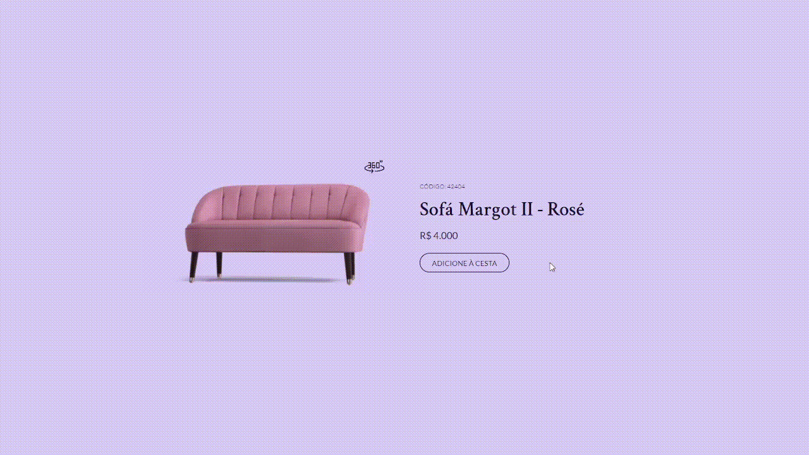

<h1 align="center"> Bora Code Segundo Desafio </h1>

# Projeto

Esse é o segundo desafio do bora code, tendo como intuito a criação da interface de um card de produto.

# Link

> <https://gustav0dedeus.github.io/BoraCode-2/>

# Linguagens

* <h2>HTML</h2>
* <h2>CSS</h2>
* <h2>JS</H2>
